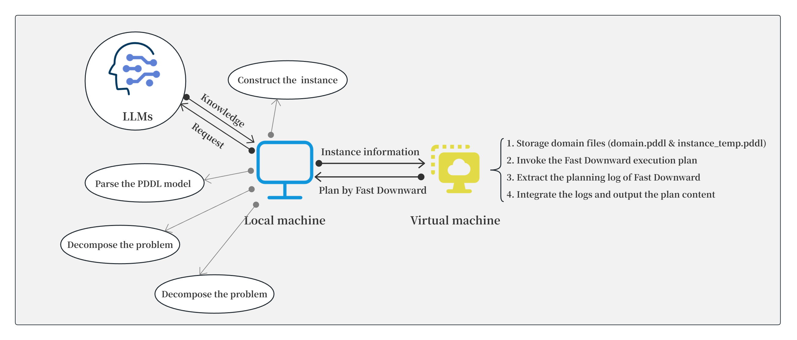

# LLMs-assisted4planning
Inspire or Predict? Exploring New Paradigms in Assisting Classical Planners with Large Language Models

This is about reducing the problem scale through the divide-and-conquer approach, and using LLMs to assist the planner in the planning process.

This is about reducing the problem scale through the divide-and-conquer approach, and using LLMs to assist the planner in the planning process.
For the specific content, please refer to the article "Inspire or Predict? Exploring New Paradigms in Assisting Classical Planners with Large Language Models".

If you need to reproduce this project, you will need to download the planner Fast Downward on your local machine. We installed a virtual machine on the local Windows system and also equipped it with Linux system to support Fast Downward. Meanwhile, the Linux system also needs to create separate folders for each domain. Each folder should contain the corresponding domain.pddl and instance_temp.pddl files for the respective field. The "linux_script" directory contains all the Python scripts we have for the Linux system.

